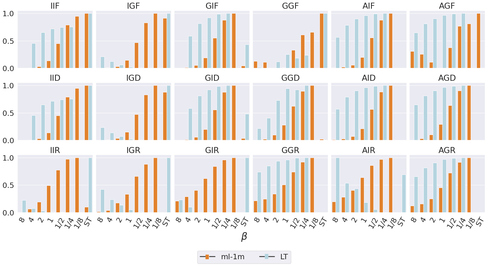

# JME-Fairness

This repository reproduces the paper [Joint Multisided Exposure Fairness for Recommendation](https://arxiv.org/abs/2205.00048) (SIGIR 2022) as part of the [ML Reproducibility Challenge 2022](https://paperswithcode.com/rc2022), and an extention of the JME-fairness framework to the neural Bert4Rec model.


*The JME-Fairness metrics calculated across a neural Bert4Rec model, for the MovieLens1M (orange) and the LibraryThing (turquoise) dataset.*

## Installation

``` Installing and configuring repo
git clone https://github.com/OlineRanum/FACT.git
cd FACT
bash env/setup.sh
```

## How to use the code
This section provides examples of how to use the repository

### Per experiment
How to run a single experiment
#### To run a single experiment with default setting
```
python3 src/run_metric.py 
```
#### Produce the toy example experiment results
```
python3 src/utils/evaluation_functions/fariness_metrics.py
```

### To run all experiments associated with the reproduction study 
In the subsequent section we provide instructions on running bash-scripts that reproduce all the fairness metric calculations associated with our paper, and how to plot 

#### Reproduce all plots in our reproduction study
```
bash experiments/run_files/plot_reproduction_results.sh
```
## Rerun all metric calculations on MovieLens1M dataset
NB! Expected runtime on RTX 3070 GPU is 13h - this will estimate the fairness metrics across all 21 pretrained models to build the kendal rank correlations for the MovieLens1M dataset. 

```
bash experiments/run_files/run_metrics_movielens.sh
```

## Rerun all metric calculations on LibraryThing dataset
NB! Expected runtime on RTX 3070 GPU is 15h - this will estimate the fairness metrics across all 21 pretrained models to build the kendal rank correlations for the LibraryThing dataset. 

```
bash experiments/run_files/run_metrics_librarything.sh
```

## Train Bert4Rec
```
bash 
```


## Directory Overview
### Folder
The [`env`](./env) contains the environment to run this codebase and a bash script _setup.sh_ to download the LibraryTh
ing dataset and install/activate the environment. 

The [`experiments`](./experiments) contains the run files with all the bash scripts to reproduce all experiments associated with the reproduction study. 

The [`Figures`](./Figures) contains the coverpicture.

The [`src`](./src) contains the source code of the project. 

## Datasets 

### MovieLens
MovieLens1M (ml‐1m) consists of 1,000,209 numerical ratings ranging from 1‐5. The reviews are supplied by 6,040 MovieLens users on 3,706 movies. The available metadata for the users includes 2 gender groups, 7 age groups, 21 occupation groups, and zip codes. The metadata for the movies comprises 19 genre groups (including unknown). Each user in the dataset has written at least 20 reviews.

The datasets is extracted from [here](https://grouplens.org/datasets/movielens/), please note that the dataset is already avilable in the repository.


### Librarything
LibraryThing (LT) Due to computational limitations we extract a subset of the LibraryThing dataset comprised of 702,522 reviews provided by 12,976 LibraryThing users on 325,075 books. The selection is made so that each user has written at least 20 reviews and each item is reviewed at least 3 times.

The datasets is extracted from [here](https://cseweb.ucsd.edu/~jmcauley/datasets.html), please note that the dataset is automatically downloaded when running the setup script.


## Acknowledgements
* The authors of the original paper H. Wu et al., in particular Dr. Bhaskar Mitra and Haloun Wu for supplying additional information regarding the pipeline and codebase of the original paper.
* [Template source](https://www.overleaf.com/project/62fcf81c144fd47671a39284)


## Citation of the original paper
```
@inproceedings{wu2022joint,
  title={Joint Multisided Exposure Fairness for Recommendation},
  author={Wu, Haolun and Mitra, Bhaskar and Ma, Chen and Diaz, Fernando and Liu, Xue},
  booktitle={SIGIR},
  publisher = {{ACM}},
  year={2022}
}
```

